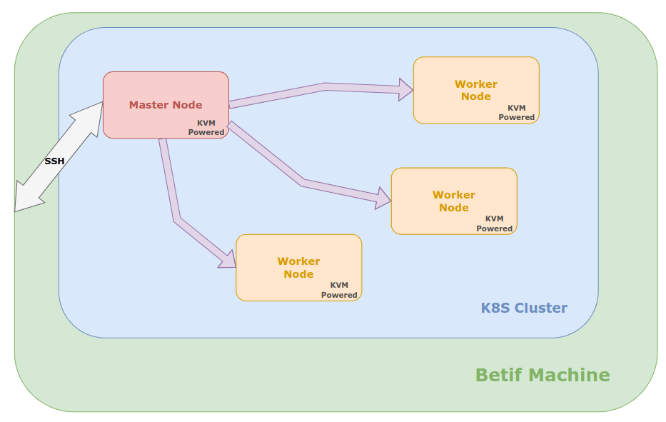

===================
Administrator Guide
===================

This section provides guidance for administrators managing the BETIF/DIFAET system. It covers installation, configuration, and maintenance tasks to ensure the system runs smoothly.
The scripts shown below are also available in the `helper-scripts repository`_.

.. _helper-scripts repository: https://github.com/BETIF-DIFAET/helper-scripts

-----------------------------------------------
Kernel-based Virtual Machine (KVM) Installation
-----------------------------------------------

The BETIF-DIFAET machine runs AlmaLinux 9 as its operating system, and, as is common across many Linux distributions, it supports Kernel-based Virtual Machines (KVM) for virtualizing bare-metal 
resources. KVM is a full virtualization solution for Linux on x86 hardware containing virtualization extensions (Intel VT or AMD-V). This tool allows to run multiple virtual machines running 
unmodified Linux or Windows images. Each virtual machine has private virtualized hardware: a network card, disk, graphics adapter, etc.

In order to test the steps to create the computing platform, 4 VMs have been spawned based on AlmaLinux 9 as Operating system and 16 vCPUs, 32 GB of RAM and 80 GB of disk space, through 
the ``virt-install`` interface.

:numref:`create-master-node-vm` can be used to create a virtual machine acting as a master node for the BETIF-DIFAET system.

.. code-block:: bash
    :caption: : Script to create a master node VM for BETIF-DIFAET
    :name: create-master-node-vm

    #!/usr/bin/env bash
    vm_name='alma9-test-master'
    vm_memory='32768'
    vm_cpus='16'
    vm_disk='/var/lib/libvirt/images/AlmaLinux-9-GenericCloud-latest.x86_64.qcow2'

    ci_user_data='user-data'
    ci_network_config='network-configv3'
    qemu-img create -f qcow2 \
        -b /var/lib/libvirt/images/AlmaLinux-9-GenericCloud-latest.x86_64.qcow2 \
        -F qcow2 /var/lib/libvirt/images/rke2-master-AlmaLinux-9-test-master.qcow2 80G

    vm_disk='/var/lib/libvirt/images/rke2-master-AlmaLinux-9-test-master.qcow2'

    virt-install \
        --connect qemu:///system \
        --name "$vm_name" \
        --memory "$vm_memory" \
        --machine q35 \
        --vcpus "$vm_cpus" \
        --cpu host-passthrough \
        --import \
        --cloud-init user-data="$ci_user_data" \
        --osinfo name=almalinux9 \
        --disk "$vm_disk" \
        --virt-type kvm \
        --network network=private-net \
        --network network=default \
        --noautoconsole

:numref:`create-worker-node-vm` can be used to create a virtual machine acting as a worker node for the BETIF-DIFAET system.

.. code-block:: bash
    :caption: : Script to create a worker node VM for BETIF-DIFAET
    :name: create-worker-node-vm

    #!/usr/bin/env bash

    if [ -z "$1" ]; then
        echo "Usage: $0 <worker-number>"
        exit 1
    fi

    N="$1"
    vm_name="alma9-test-worker-$N"
    vm_memory='32768'
    vm_cpus='16'
    vm_base_disk='/var/lib/libvirt/images/AlmaLinux-9-GenericCloud-latest.x86_64.qcow2'

    ci_user_data='user-data'
    ci_network_config='network-configv3'

    vm_disk="/var/lib/libvirt/images/rke2-master-AlmaLinux-9-test-worker-$N.qcow2"

    qemu-img create -f qcow2 -b "$vm_base_disk" -F qcow2 "$vm_disk" 80G

    virt-install \        --connect qemu:///system \
        --name "$vm_name" \
        --memory "$vm_memory" \
        --machine q35 \
        --vcpus "$vm_cpus" \
        --cpu host-passthrough \
        --import \
        --cloud-init user-data="$ci_user_data" \
        --osinfo name=almalinux9 \
        --disk "$vm_disk" \
        --virt-type kvm \
        --network network=private-net \
        --noautoconsole    

A :ref:`private-network-interface` was also created to enable direct connections between the different VMs which for debug and testing purposes is still left open to allow direct access to the 
worker nodes. In the actual deployment this network will block access to the worker VMs, leaving only the Master accessible via SSH.

.. code-block:: xml
    :caption: : Private network interface
    :name: private-network-interface

    <network>
      <name>private-net</name>
      <forward mode='nat'/>
      <bridge name="virbr1"/>
      <ip address="10.10.142.1" netmask="255.255.255.0">
        <dhcp>
          <range start="10.10.142.100" end="10.10.142.200"/>
        </dhcp>
      </ip>
    </network>

^^^^^^^^^^^^^^^^^^^^^^^^^^
Turn on GPU Virtualization
^^^^^^^^^^^^^^^^^^^^^^^^^^

Up until now, the creation of VMs has relied on virtualization technologies (e.g., VT-x for Intel CPUs), which do not expose hardware connected to the host machine via a PCIe interface.  
To enable the passthrough of PCIe expansion devices, such as GPUs or FPGA accelerator cards, ``VT-d`` (Intel) or ``AMD-V`` (AMD) must be activated in the BIOS setup menu.

Once enabled in the firmware, the procedure continues in the host operating system: PCIe passthrough must also be allowed in the kernel.

Run:

.. code-block:: bash

   find /sys/kernel/iommu_groups/ -type l

If no output is returned, the kernel boot options must be updated.

On AlmaLinux 9, with an Intel CPU and chipset, this can be done with:

.. code-block:: bash

   grubby --update-kernel=ALL --args="intel_iommu=on iommu=pt"

After a reboot, the ``iommu_groups`` folder should be populated with all devices that can be passed through to VMs.

To use a device inside a VM, it must not be in use by the host system, i.e., the default driver must not be loaded.  
For example, with two identical GPUs, a rule must be added at boot time in ``/etc/udev/rules.d/99-vfio.rules``:

.. code-block::

   ACTION=="add", SUBSYSTEM=="pci", KERNEL=="0000:<PCI-ID of device>", DRIVER=="", ATTR{driver_override}="vfio-pci"

The ``PCI-ID`` can be retrieved using ``lspci``.

Next, load the ``vfio-pci`` driver, which is responsible for virtualization handling:

.. code-block:: bash

   modprobe vfio-pci

.. IMPORTANT::

   Due to issues with the order in which rules are applied during boot, ``vfio-pci`` is not yet loaded automatically.  
   This command must therefore be run manually after every reboot. The driver will automatically attach to the configured hardware.

Finally, update the operating system configuration (``initramfs``) with:

.. code-block:: bash

   dracut -f

At this point, a VM with access to a GPU can be create with the following instruction:

.. code-block:: bash

 virt-install \
    --connect qemu:///system \
    --name "$vm_name" \
    --memory "$vm_memory" \
    --machine q35 \
    --vcpus "$vm_cpus" \
    --cpu host-passthrough \
    --import \
    --cloud-init user-data="$ci_user_data" \
    --osinfo name=almalinux9 \
    --disk "$vm_disk" \
    --virt-type kvm \
    --network network=private-net \
    --network network=default \
    --noautoconsole \
    --hostdev <PCI-ID of device>

--------------------------------
Turning the VMs in a K8s cluster
--------------------------------

With KVM, it was possible to set up 4 different VMs with a chosen flavour in terms of virtualized hardware and software. The next step to provide a computing platform is to setup a Kubernetes 
Cluster which will allow to host all the services needed for the research environment, from authentication to end-user tools for launching code.

To streamline the process of setting up the cluster, RKE2, also known as Rancher Kubernetes Engine 2 [RKE2]_, was used. It is a Kubernetes distribution developed by Rancher (now part of SUSE) that 
emphasizes security, stability, and ease of deployment. It's designed to be fully Kubernetes-conformant, meaning it behaves in accordance with the official Kubernetes standards and APIs, making it 
compatible with standard Kubernetes tooling and workloads.

RKE2 is packaged as a single binary, which simplifies installation and maintenance. This binary includes everything needed to run a Kubernetes node, including the container runtime (which is containerd, 
rather than Docker), as well as the control plane and networking components. This design eliminates many of the dependencies and complexities found in traditional Kubernetes setups.

:numref:`install-rke-master` can be used to install RKE2 on the master node:

.. code-block:: bash
    :caption: : Script to install RKE2 on the master node
    :name: install-rke-master

    mkdir -p /etc/rancher/rke2/
    echo """
    tls-san:
      - 192.168.122.59
      - 10.10.142.115
    """ > /etc/rancher/rke2/config.yaml
    curl -sfL https://get.rke2.io | sh -
    systemctl enable rke2-server.service
    systemctl start rke2-server.service
    sudo cp /etc/rancher/rke2/rke2.yaml /home/clouduser/
    sudo chown clouduser /home/clouduser/rke2.yaml
    export KUBECONFIG=/home/clouduser/rke2.yaml

:numref:`install-rke-worker` can be used to install RKE2 on the worker node:

.. code-block:: bash
    :caption: : Script to install RKE2 on the worker node
    :name: install-rke-worker

    #!/bin/bash
    mkdir -p /etc/rancher/rke2/
    echo """
    server: https://10.10.142.115:9345
    token: K10e67c7985e7db4f9ed9b0353ae10f53c179a51eb4ed8443ca8596873a3327188d::server:c5cb82b52a5650b010f9e3e5f6e76b52
    node-name: worker-1
    """ > /etc/rancher/rke2/config.yaml
    curl -sfL https://get.rke2.io | INSTALL_RKE2_TYPE="agent" sh -
    systemctl enable rke2-agent.service
    systemctl start rke2-agent.service

Where ``node-name`` is the name of the worker node, which can be set to ``worker-1``, ``worker-2``, etc. depending on the number of worker nodes in the cluster.

Using RKE2, the computing architecture shown in :numref:`betif-arch` was built:

* The bare-metal server stands as foundation for all virtualization layers above;
* The Kubernetes cluster is made up of three Virtual Machines created using KVM and can comunicate through a private network;
* The Master node is accessible from the host.

.. _betif-arch:

   Schematic of the BETIF-DIFAET architecture.

^^^^^^^^^^^^^^^^^^^^^^^^^^^^^^
Setting up the GPU Worker Node
^^^^^^^^^^^^^^^^^^^^^^^^^^^^^^

To make the GPU deployable in the k8s cluster, NVidia's drivers are needed in the worker node housing the virtual GPU.

After an update of the kernel, some utilities are useful/needed to move forward

.. code-block:: bash

    dnf check-update --security
    dnf upgrade --security
    dnf install pciutils
    dnf install epel-release
    dnf install dkms gcc

Then the Nvidia Toolkit and driver have to be installed, following the instruction from [GPU1]_:

.. code-block:: bash

    dnf config-manager --add-repo https://developer.download.nvidia.com/compute/cuda/repos/rhel9/x86_64/cuda-rhel9.repo
    dnf clean all
    dnf install cuda-toolkit-12-4
    dnf module install nvidia-driver:latest-dkms
    reboot

Once the node is running after the reboot, it is possible to check if the driver is working by running ``nvidia-smi``

.. IMPORTANT::
  
  It is possible that the open-source driver ``nouveau`` is used instead of the proprietary one from Nvidia, if that is the case it can be fixed with the following

  .. code-block:: bash

    sudo tee /etc/modprobe.d/blacklist-nouveau.conf <<EOF
    blacklist nouveau
    options nouveau modeset=0
    EOF
    dracut --force
    reboot

-----------------------------------
Deploying the BETIF-DIFAET platform
-----------------------------------

Once the Kubernetes cluster is set up with RKE2, on the master node the kube-config file is available at ``/home/clouduser/rke2.yaml``. This file can be used to interact with 
the Kubernetes cluster using `kubectl`, the command-line tool for Kubernetes.

.. DANGER::
    
  The kube-config file contains sensitive information, such as the token used to authenticate with the cluster. **It should be kept secure and not shared publicly.**

.. IMPORTANT::
  
  Currently, the BETIF-DIFAET platform does not have a DNS resolved domain name. Therefore, the IP address of the master node is used to access the platform. To create an user-friendly
  domain name, add the following line to the ``/etc/hosts`` file: 

  .. code-block:: bash

    123.456.789.012 betif-difaet.jhub

  where ``123.456.789.012`` is the IP address of the master node.

The BETIF-DIFAET platform is deployed using Helm charts [HELM]_, which are packages of pre-configured Kubernetes resources. The recipe for deploying the platform is available in the 
`charts repository`_.

.. _charts repository: https://github.com/BETIF-DIFAET/charts

The steps to deploy the platform are as follows:

1. **Install Helm**: Ensure that Helm is installed on the same machine where you connect and control the Kubernetes cluster. An example of how to install Helm is shown `here`_.

.. _here: https://github.com/BETIF-DIFAET/helper-scripts/blob/main/helm/install_helm.sh

2. Add the following requirements:

* Cert-Manager:

    .. code-block:: bash

      kubectl apply -f https://github.com/cert-manager/cert-manager/releases/download/v1.13.2/cert-manager.yaml
      kubectl apply -f https://github.com/cert-manager/cert-manager/releases/download/v1.13.2/cert-manager.crds.yaml

* Local-Path storage class:

    .. code-block:: bash

      kubectl apply -f https://raw.githubusercontent.com/rancher/local-path-provisioner/v0.0.24/deploy/local-path-storage.yaml

3. **Deploy the BETIF-DIFAET platform**: Use the Helm chart to deploy the platform.

    .. code-block:: bash

      git clone git@github.com:BETIF-DIFAET/charts.git
      cd charts/stable/jhubaas
      helm repo add jupyterhub https://jupyterhub.github.io/helm-chart/
      helm dependency build
      kubectl create namespace jhub
      helm upgrade --install --cleanup-on-fail --namespace jhub jhub ./ 
    
The last command deploys the JupyterHub platform in the `jhub` namespace of the Kubernetes cluster. The deployment will take a few minutes to complete, 
and you can monitor the status of the pods using:

.. code-block:: bash

    kubectl get pods -n jhub

Once the deployment is complete, you can access the JupyterHub platform using the IP address of the master node. If you have set up a domain name in your ``/etc/hosts`` file, 
you can access it using that domain name as well (in this case `betif-difaet.jhub`).

^^^^^^^^^^^^^^^^^^^^
Customizing the jhub
^^^^^^^^^^^^^^^^^^^^

To customize the JupyterHub configuration, you can modify the ``values.yaml`` file in the Helm chart directory. This file contains various configuration options for JupyterHub,
including authentication methods (currently the Einstein Telescope IAM instance), resource limits, and more.

Once you have made your changes to the ``values.yaml`` file, you can apply them by running:

.. code-block:: bash

    helm upgrade --install --cleanup-on-fail --namespace jhub jhub ./ 

----------
References
----------

.. [RKE2] https://docs.rke2.io/
.. [HELM] https://helm.sh/
.. [GPU1] https://developer.nvidia.com/cuda-downloads?target_os=Linux&target_arch=x86_64&Distribution=RHEL&target_version=9&target_type=rpm_network
.. [GPU2] https://docs.rke2.io/advanced

