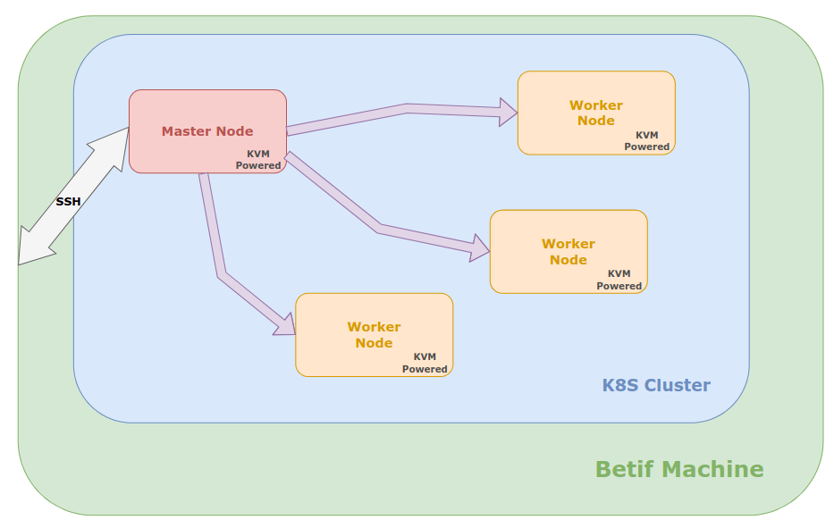

===================
Administrator Guide
===================

This section provides guidance for administrators managing the BETIF/DIFAET system. It covers installation, configuration, and maintenance tasks to ensure the system runs smoothly.
The scripts shown below are also available in the `helper-scripts repository`_.

.. _helper-scripts repository: https://github.com/BETIF-DIFAET/helper-scripts

-----------------------------------------------
Kernel-based Virtual Machine (KVM) Installation
-----------------------------------------------

The BETIF-DIFAET machine runs AlmaLinux 9 as its operating system, and, as is common across many Linux distributions, it supports Kernel-based Virtual Machines (KVM) for virtualizing bare-metal 
resources. KVM is a full virtualization solution for Linux on x86 hardware containing virtualization extensions (Intel VT or AMD-V). This tool allows to run multiple virtual machines running 
unmodified Linux or Windows images. Each virtual machine has private virtualized hardware: a network card, disk, graphics adapter, etc.

In order to test the steps to create the computing platform, 4 VMs have been spawned based on AlmaLinux 9 as Operating system and 16 vCPUs, 32 GB of RAM and 80 GB of disk space, through 
the ``virt-install`` interface.

:numref:`create-master-node-vm` can be used to create a virtual machine acting as a master node for the BETIF-DIFAET system.

.. code-block:: bash
    :caption: : Script to create a master node VM for BETIF-DIFAET
    :name: create-master-node-vm

    #!/usr/bin/env bash
    vm_name='alma9-test-master'
    vm_memory='32768'
    vm_cpus='16'
    vm_disk='/var/lib/libvirt/images/AlmaLinux-9-GenericCloud-latest.x86_64.qcow2'

    ci_user_data='user-data'
    ci_network_config='network-configv3'
    qemu-img create -f qcow2 \
        -b /var/lib/libvirt/images/AlmaLinux-9-GenericCloud-latest.x86_64.qcow2 \
        -F qcow2 /var/lib/libvirt/images/rke2-master-AlmaLinux-9-test-master.qcow2 80G

    vm_disk='/var/lib/libvirt/images/rke2-master-AlmaLinux-9-test-master.qcow2'

    virt-install \
        --connect qemu:///system \
        --name "$vm_name" \
        --memory "$vm_memory" \
        --machine q35 \
        --vcpus "$vm_cpus" \
        --cpu host-passthrough \
        --import \
        --cloud-init user-data="$ci_user_data" \
        --osinfo name=almalinux9 \
        --disk "$vm_disk" \
        --virt-type kvm \
        --network network=private-net \
        --network network=default \
        --noautoconsole

:numref:`create-worker-node-vm` can be used to create a virtual machine acting as a worker node for the BETIF-DIFAET system.

.. code-block:: bash
    :caption: : Script to create a worker node VM for BETIF-DIFAET
    :name: create-worker-node-vm

    #!/usr/bin/env bash

    if [ -z "$1" ]; then
        echo "Usage: $0 <worker-number>"
        exit 1
    fi

    N="$1"
    vm_name="alma9-test-worker-$N"
    vm_memory='32768'
    vm_cpus='16'
    vm_base_disk='/var/lib/libvirt/images/AlmaLinux-9-GenericCloud-latest.x86_64.qcow2'

    ci_user_data='user-data'
    ci_network_config='network-configv3'

    vm_disk="/var/lib/libvirt/images/rke2-master-AlmaLinux-9-test-worker-$N.qcow2"

    qemu-img create -f qcow2 -b "$vm_base_disk" -F qcow2 "$vm_disk" 80G

    virt-install \        --connect qemu:///system \
        --name "$vm_name" \
        --memory "$vm_memory" \
        --machine q35 \
        --vcpus "$vm_cpus" \
        --cpu host-passthrough \
        --import \
        --cloud-init user-data="$ci_user_data" \
        --osinfo name=almalinux9 \
        --disk "$vm_disk" \
        --virt-type kvm \
        --network network=private-net \
        --noautoconsole    

A :ref:`private-network-interface` was also created to enable direct connections between the different VMs which for debug and testing purposes is still left open to allow direct access to the 
worker nodes. In the actual deployment this network will block access to the worker VMs, leaving only the Master accessible via SSH.

.. code-block:: xml
    :caption: : Private network interface
    :name: private-network-interface

    <network>
      <name>private-net</name>
      <forward mode='nat'/>
      <bridge name="virbr1"/>
      <ip address="10.10.142.1" netmask="255.255.255.0">
        <dhcp>
          <range start="10.10.142.100" end="10.10.142.200"/>
        </dhcp>
      </ip>
    </network>

^^^^^^^^^^^^^^^^^^^^^^^^^^
Turn on GPU Virtualization
^^^^^^^^^^^^^^^^^^^^^^^^^^

Up until now, the creation of VMs has relied on virtualization technologies (e.g., VT-x for Intel CPUs), which do not expose hardware connected to the host machine via a PCIe interface.  
To enable the passthrough of PCIe expansion devices, such as GPUs or FPGA accelerator cards, ``VT-d`` (Intel) or ``AMD-V`` (AMD) must be activated in the BIOS setup menu.

Once enabled in the firmware, the procedure continues in the host operating system: PCIe passthrough must also be allowed in the kernel.

Run:

.. code-block:: bash

   find /sys/kernel/iommu_groups/ -type l

If no output is returned, the kernel boot options must be updated.

On AlmaLinux 9, with an Intel CPU and chipset, this can be done with:

.. code-block:: bash

   grubby --update-kernel=ALL --args="intel_iommu=on iommu=pt"

After a reboot, the ``iommu_groups`` folder should be populated with all devices that can be passed through to VMs.

To use a device inside a VM, it must not be in use by the host system, i.e., the default driver must not be loaded.  
For example, with two identical GPUs, a rule must be added at boot time in ``/etc/udev/rules.d/99-vfio.rules``:

.. code-block::

   ACTION=="add", SUBSYSTEM=="pci", KERNEL=="0000:<PCI-ID of device>", DRIVER=="", ATTR{driver_override}="vfio-pci"

The ``PCI-ID`` can be retrieved using ``lspci``.

Next, load the ``vfio-pci`` driver, which is responsible for virtualization handling:

.. code-block:: bash

   modprobe vfio-pci

.. IMPORTANT::

   Due to issues with the order in which rules are applied during boot, ``vfio-pci`` is not yet loaded automatically.  
   This command must therefore be run manually after every reboot. The driver will automatically attach to the configured hardware.

Finally, update the operating system configuration (``initramfs``) with:

.. code-block:: bash

   dracut -f

At this point, a VM with access to a GPU can be create with the following instruction:

.. code-block:: bash

 virt-install \
    --connect qemu:///system \
    --name "$vm_name" \
    --memory "$vm_memory" \
    --machine q35 \
    --vcpus "$vm_cpus" \
    --cpu host-passthrough \
    --import \
    --cloud-init user-data="$ci_user_data" \
    --osinfo name=almalinux9 \
    --disk "$vm_disk" \
    --virt-type kvm \
    --network network=private-net \
    --network network=default \
    --noautoconsole \
    --hostdev <PCI-ID of device>

^^^^^^^^^^^^^^^^^^^^^^^^^^^^^^
Setting up the GPU Worker Node
^^^^^^^^^^^^^^^^^^^^^^^^^^^^^^

To make the GPU deployable in the k8s cluster, NVidia's drivers are needed in the worker node housing the virtual GPU.

After an update of the kernel, some utilities are useful/needed to move forward

.. code-block:: bash

    dnf check-update --security
    dnf upgrade --security
    dnf install pciutils
    dnf install epel-release
    dnf install dkms gcc

Then the Nvidia Toolkit and driver have to be installed, following the instruction from [GPU1]_:

.. code-block:: bash

    dnf config-manager --add-repo https://developer.download.nvidia.com/compute/cuda/repos/rhel9/x86_64/cuda-rhel9.repo
    dnf clean all
    dnf install cuda-toolkit-12-4
    dnf module install nvidia-driver:580-dkms

In order to actually add the nvidia driver to the kernel run ``dkms status`` and then

.. code-block:: bash

    dkms install nvidia/<version>
    reboot

Once the node is running after the reboot, it is possible to check if the driver is working by running ``nvidia-smi``

.. IMPORTANT::
  
  It is possible that the open-source driver ``nouveau`` is used instead of the proprietary one from Nvidia, if that is the case it can be fixed with the following

  .. code-block:: bash

    sudo tee /etc/modprobe.d/blacklist-nouveau.conf <<EOF
    blacklist nouveau
    options nouveau modeset=0
    EOF
    dracut --force
    reboot

^^^^^^^^^^
NFS server
^^^^^^^^^^

All pods spawned by JupyterHub will contain a ``persistent-storage`` folder hosted in a NFS server.

The procedure for provisioning this storage starts from launching in a fresh VM

.. code-block:: bash

    dnf install nfs-utils
    systemctl enable --now nfs-server

Then the folder to export is created with ``sudo mkdir -p /srv/nfs/k8s`` and its owner and r/w permissions are changed to

.. code-block:: bash

    chown -R nobody:nobody /srv/nfs/k8s/
    chmod -R 0777 /srv/nfs/k8s

Finally, the rules of the export are set and the filesystem is made visible

.. code-block:: bash

    /srv/nfs/k8s *(rw,sync,no_subtree_check,no_root_squash)
    exportfs -ra

^^^^^^^^^^^^^^^^^^^^^^^^^^^^^^^^^^^^^^^^^
VM Configurations for FPGA Virtualization
^^^^^^^^^^^^^^^^^^^^^^^^^^^^^^^^^^^^^^^^^
Deployment parameters
---------------------

Replace the placeholders below with the values for the target deployment. Subnet placeholders include the CIDR prefix; gateway and host placeholders contain a single address.

.. list-table::
   :header-rows: 1
   :widths: 35 65

   * - Item
     - Value
   * - Existing cluster hypervisor
     - ``hyperA`` / ``<HYPER_A_LAN_IP>``
   * - FPGA hypervisor
     - ``hyperB`` / ``<HYPER_B_LAN_IP>``
   * - Existing cluster VM network
     - ``private-net`` / ``<CLUSTER_VM_SUBNET>`` / ``virbr1``
   * - Existing cluster VM gateway
     - ``<CLUSTER_VM_GATEWAY>``
   * - Existing cluster netmask
     - ``<CLUSTER_VM_NETMASK>``
   * - Existing cluster DHCP range
     - ``<CLUSTER_VM_DHCP_START>``--``<CLUSTER_VM_DHCP_END>``
   * - FPGA worker VM network
     - ``k8s-routed`` / ``<FPGA_WORKER_SUBNET>`` / ``virbr2``
   * - FPGA worker VM gateway
     - ``<FPGA_WORKER_GATEWAY>``
   * - FPGA worker netmask
     - ``<FPGA_WORKER_NETMASK>``
   * - FPGA worker DHCP range
     - ``<FPGA_WORKER_DHCP_START>``--``<FPGA_WORKER_DHCP_END>``
   * - RKE2 endpoint
     - ``<RKE2_SERVER_IP>:9345``
   * - FPGA worker VM
     - ``alma9-worker-fpga``
   * - FPGA worker address
     - ``<FPGA_WORKER_IP>``
   * - Former libvirt NAT address
     - ``<OLD_NAT_IP>``
   * - External connectivity test
     - ``<EXTERNAL_TEST_IP>``
   * - HyperB uplink
     - ``eno1``
   * - HyperA uplink
     - ``enp3s0f0``
   * - FPGA Card functions on HyperB
     - ``0000:01:00.0``, ``0000:01:00.1``
   * - Guest OS
     - AlmaLinux 9
   * - Validated guest kernel
     - ``5.14.0-427.13.1.el9_4.x86_64``
   * - Validated XRT
     - ``2.26.0``

1. One-time routed network setup for adding external VM to the cluster
----------------------------------------------------------------------

1.1 HyperA: ``private-net``
~~~~~~~~~~~~~~~~~~~~~~~~~~~

``private-net`` must use routed mode. Its persistent definition is:

.. code:: xml

   <network>
     <name>private-net</name>
     <uuid>928084d2-145c-4d6b-a749-20f685df7bc5</uuid>
     <forward mode='route'/>
     <bridge name='virbr1' stp='on' delay='0'/>
     <mac address='52:54:00:2c:f5:50'/>
     <ip address='<CLUSTER_VM_GATEWAY>' netmask='<CLUSTER_VM_NETMASK>'>
       <dhcp>
         <range start='<CLUSTER_VM_DHCP_START>' end='<CLUSTER_VM_DHCP_END>'/>
       </dhcp>
     </ip>
   </network>

When rebuilding the network, stop the VMs attached to it, then redefine it:

.. code:: bash

   virsh net-destroy private-net
   virsh net-define private-net-route.xml
   virsh net-autostart private-net
   virsh net-start private-net

Add the route to the FPGA worker subnet:

.. code:: bash

   ip route add <FPGA_WORKER_SUBNET> via <HYPER_B_LAN_IP> dev enp3s0f0

Restore outbound Internet access for the existing cluster VMs:

.. code:: bash

   iptables -t nat -A POSTROUTING \
     -s <CLUSTER_VM_SUBNET> \
     -o enp3s0f0 \
     -j MASQUERADE

1.2 HyperB: ``k8s-routed``
~~~~~~~~~~~~~~~~~~~~~~~~~~

Create ``k8s-routed.xml``:

.. code:: xml

   <network>
     <name>k8s-routed</name>
     <forward mode='route'/>
     <bridge name='virbr2' stp='on' delay='0'/>
     <ip address='<FPGA_WORKER_GATEWAY>' netmask='<FPGA_WORKER_NETMASK>'>
       <dhcp>
         <range start='<FPGA_WORKER_DHCP_START>' end='<FPGA_WORKER_DHCP_END>'/>
       </dhcp>
     </ip>
   </network>

Define and start it:

.. code:: bash

   virsh net-define k8s-routed.xml
   virsh net-autostart k8s-routed
   virsh net-start k8s-routed
   virsh net-dumpxml k8s-routed

Enable forwarding:

.. code:: bash

   sysctl -w net.ipv4.ip_forward=1

Add the route to the existing cluster network:

.. code:: bash

   ip route add <CLUSTER_VM_SUBNET> via <HYPER_A_LAN_IP> dev eno1

Persist it in the existing NetworkManager profile:

.. code:: bash

   nmcli connection modify "System eth0" \
     +ipv4.routes "<CLUSTER_VM_SUBNET> <HYPER_A_LAN_IP>"

   nmcli device reapply eno1

Restore outbound Internet access for VMb and save the active rules:

.. code:: bash

   iptables -t nat -A POSTROUTING \
     -s <FPGA_WORKER_SUBNET> \
     -o eno1 \
     -j MASQUERADE

   iptables-save > /etc/sysconfig/iptables

Check the final state:

.. code:: bash

   ip route get <RKE2_SERVER_IP>
   sysctl net.ipv4.ip_forward
   iptables -t nat -S POSTROUTING

Expected route:

.. code:: text

   <RKE2_SERVER_IP> via <HYPER_A_LAN_IP> dev eno1

2. Configure the FPGA worker VM
-------------------------------

The VM must have only the routed cluster NIC. Do not keep an interface connected to libvirt's ``default`` network; that caused RKE2 and Flannel to advertise ``<OLD_NAT_IP>``.

Edit the VM if already created:

.. code:: bash

   virsh shutdown alma9-worker-fpga
   virsh edit alma9-worker-fpga

The remaining interface must use ``k8s-routed``:

.. code:: xml

   <interface type='network'>
     <source network='k8s-routed'/>
     <model type='virtio'/>
   </interface>

Remove any interface containing:

.. code:: xml

   <source network='default'/>

The VM definition must also contain both FPGA Card PCI functions, ``0000:01:00.0`` and ``0000:01:00.1``. The existing VM creation/helper scripts on HyperB are used to add them.

3. Prepare the FPGA on HyperB and start the VM
----------------------------------------------

Confirm the host PCI addresses:

.. code:: bash

   lspci -Dnnk -d 10ee:

Load the validated base platform when required:

.. code:: bash

   source /opt/xilinx/xrt/setup.sh
   xbmgmt program --base -d 0000:01:00

Bind both functions to ``vfio-pci`` before starting the VM:

.. code:: bash

   modprobe vfio
   modprobe vfio_pci

   echo 0000:01:00.0 > /sys/bus/pci/drivers/xclmgmt/unbind
   echo 0000:01:00.1 > /sys/bus/pci/drivers/xocl/unbind

   echo vfio-pci > /sys/bus/pci/devices/0000:01:00.0/driver_override
   echo vfio-pci > /sys/bus/pci/devices/0000:01:00.1/driver_override

   echo 0000:01:00.0 > /sys/bus/pci/drivers_probe
   echo 0000:01:00.1 > /sys/bus/pci/drivers_probe

   lspci -k -s 01:00.0
   lspci -k -s 01:00.1

Both functions must show ``vfio-pci`` before starting the VM.

Inside VMb, the final network state is:

.. code:: bash

   ip addr
   ip route

Expected route:

.. code:: text

   default via <FPGA_WORKER_GATEWAY> dev eth0
   <FPGA_WORKER_SUBNET> dev eth0

4. Install XRT and the FPGA platform packages in VMb
-------------------------------------------

4.2 XRT 2.26.0
~~~~~~~~~~~~~~

Install the known-good RPM when it is already available:

.. code:: bash

   dnf install xrt_202620.2.26.0_9.8-x86_64-xrt.rpm

If the RPM must be rebuilt, the successful build path was:

.. code:: bash

   dnf install git
   git clone https://github.com/DrWatt/XRT.git

   source XRT/src/runtime_src/tools/scripts/xrtdeps.sh
   export PATH=$PATH:/usr/local/bin

   mkdir -p /home/clouduser/firmware/xilinx
   mv sched*.bin /home/clouduser/firmware/xilinx/

   cd XRT/build
   ./build.sh -ertfw /home/clouduser/firmware/xilinx/ -noert
   cd Release
   dnf install xrt_202620.2.26.0_9.8-x86_64-xrt.rpm

The DKMS source required the local ``qdma_mbox.c`` compatibility edit:

.. code:: bash

   vi /usr/src/xrt-2.26.0/driver/xocl/lib/libqdma/QDMA/linux-kernel/driver/libqdma/qdma_mbox.c

The timer callback uses:

.. code:: c

   container_of(t, struct qdma_mbox, timer);

Rebuild the module:

.. code:: bash

   dkms remove xrt/2.26.0 --all
   dkms add -m xrt -v 2.26.0
   dkms build -m xrt -v 2.26.0 -k "$(uname -r)"
   dkms install -m xrt -v 2.26.0 -k "$(uname -r)"

4.3 FPGA platform packages
~~~~~~~~~~~~~~~~~~~~~~~~~~

Install EPEL and use the existing ``/etc/yum.repos.d/xlnx.repo`` used on this host:

.. code:: bash

   yum install -y \
     https://dl.fedoraproject.org/pub/epel/epel-release-latest-9.noarch.rpm

   dnf makecache

Install the validated package set (here u55c as an example):

.. code:: bash

   dnf install \
     xilinx-u55c-gen3x16-xdma-base-3-3494559.noarch \
     xilinx-u55c-gen3x16-xdma-validate-3-3506150.noarch \
     xilinx-sc-fw-u55-7.1.22-1.b8c3d15.noarch \
     xilinx-cmc-u55-1.5.25-3395704.noarch

Validate the guest installation. The guest BDF may change, so discover it first:

.. code:: bash

   lspci -nnk | grep -i -A4 -B1 -E 'Xilinx|AMD'
   source /opt/xilinx/xrt/setup.sh
   xrt-smi examine
   xrt-smi validate -d <guest-user-PF>

If the firmware files are present but reported as unreadable:

.. code:: bash

   chmod -R a+r /lib/firmware/xilinx
   restorecon -Rv /lib/firmware/xilinx

--------------------------------
Turning the VMs in a K8s cluster
--------------------------------

With KVM, it was possible to set up 4 different VMs with a chosen flavour in terms of virtualized hardware and software. The next step to provide a computing platform is to setup a Kubernetes 
Cluster which will allow to host all the services needed for the research environment, from authentication to end-user tools for launching code.

To streamline the process of setting up the cluster, RKE2, also known as Rancher Kubernetes Engine 2 [RKE2]_, was used. It is a Kubernetes distribution developed by Rancher (now part of SUSE) that 
emphasizes security, stability, and ease of deployment. It's designed to be fully Kubernetes-conformant, meaning it behaves in accordance with the official Kubernetes standards and APIs, making it 
compatible with standard Kubernetes tooling and workloads.

RKE2 is packaged as a single binary, which simplifies installation and maintenance. This binary includes everything needed to run a Kubernetes node, including the container runtime (which is containerd, 
rather than Docker), as well as the control plane and networking components. This design eliminates many of the dependencies and complexities found in traditional Kubernetes setups.

:numref:`install-rke-master` can be used to install RKE2 on the master node:

.. code-block:: bash
    :caption: : Script to install RKE2 on the master node
    :name: install-rke-master

    mkdir -p /etc/rancher/rke2/
    echo """
    tls-san:
      - 192.168.122.59
      - 10.10.142.115
    """ > /etc/rancher/rke2/config.yaml
    curl -sfL https://get.rke2.io | sh -
    systemctl enable rke2-server.service
    systemctl start rke2-server.service
    sudo cp /etc/rancher/rke2/rke2.yaml /home/clouduser/
    sudo chown clouduser /home/clouduser/rke2.yaml
    export KUBECONFIG=/home/clouduser/rke2.yaml

:numref:`install-rke-worker` can be used to install RKE2 on the worker node:

.. code-block:: bash
    :caption: : Script to install RKE2 on the worker node
    :name: install-rke-worker

    #!/bin/bash
    mkdir -p /etc/rancher/rke2/
    echo """
    server: https://10.10.142.115:9345
    token: K10e67c7985e7db4f9ed9b0353ae10f53c179a51eb4ed8443ca8596873a3327188d::server:c5cb82b52a5650b010f9e3e5f6e76b52
    node-name: worker-1
    """ > /etc/rancher/rke2/config.yaml
    curl -sfL https://get.rke2.io | INSTALL_RKE2_TYPE="agent" sh -
    systemctl enable rke2-agent.service
    systemctl start rke2-agent.service

Where ``node-name`` is the name of the worker node, which can be set to ``worker-1``, ``worker-2``, etc. depending on the number of worker nodes in the cluster.

Using RKE2, the computing architecture shown in :numref:`betif-arch` was built:

* The bare-metal server stands as foundation for all virtualization layers above;
* The Kubernetes cluster is made up of three Virtual Machines created using KVM and can comunicate through a private network;
* The Master node is accessible from the host.

.. _betif-arch:

   Schematic of the BETIF-DIFAET architecture.

----------------------------------------
Deploying the BETIF-DIFAET jhub platform
----------------------------------------

Once the Kubernetes cluster is set up with RKE2, on the master node the kube-config file is available at ``/home/clouduser/rke2.yaml``. This file can be used to interact with 
the Kubernetes cluster using `kubectl`, the command-line tool for Kubernetes.

.. DANGER::
    
  The kube-config file contains sensitive information, such as the token used to authenticate with the cluster. **It should be kept secure and not shared publicly.**

.. IMPORTANT::
  
  Currently, the BETIF-DIFAET platform does not have a DNS resolved domain name. Therefore, the IP address of the master node is used to access the platform. To create an user-friendly
  domain name, add the following line to the ``/etc/hosts`` file: 

  .. code-block:: bash

    123.456.789.012 betif-difaet.jhub

  where ``123.456.789.012`` is the IP address of the master node.

The BETIF-DIFAET platform is deployed using Helm charts [HELM]_, which are packages of pre-configured Kubernetes resources. The recipe for deploying the platform is available in the 
`charts repository`_.

.. _charts repository: https://github.com/BETIF-DIFAET/charts

The steps to deploy the platform are as follows:

1. **Install Helm**: Ensure that Helm is installed on the same machine where you connect and control the Kubernetes cluster. An example of how to install Helm is shown `here`_.

.. _here: https://github.com/BETIF-DIFAET/helper-scripts/blob/main/helm/install_helm.sh

2. Add the following requirements:

* Cert-Manager:

  .. code-block:: bash

    kubectl apply -f https://github.com/cert-manager/cert-manager/releases/download/v1.13.2/cert-manager.yaml
    kubectl apply -f https://github.com/cert-manager/cert-manager/releases/download/v1.13.2/cert-manager.crds.yaml

* Label nodes with no GPU, to perform node selection during the deployment of the JupyterHub platform:

  .. code-block:: bash

    kubectl label node worker-N nvidia.com/gpu.present=false

  This is not needed for the node with the GPU, which will be automatically detected by the NVIDIA device plugin (see later).

3. NFS external provisioner:

.. code-block:: bash

  helm repo add nfs-subdir-external-provisioner https://kubernetes-sigs.github.io/nfs-subdir-external-provisioner/
  helm repo update
  kubectl create namespace kube-storage
  helm install nfs-provisioner nfs-subdir-external-provisioner/nfs-subdir-external-provisioner \
    --namespace kube-storage \
    --set nfs.server=<NFS_SERVER_IP> \
    --set nfs.path=/srv/nfs/k8s

where ``<NFS_SERVER_IP>`` is the IP address of the NFS VM created earlier.

4. **Deploy the BETIF-DIFAET platform**: Use the Helm chart to deploy the platform.

.. code-block:: bash

  git clone git@github.com:BETIF-DIFAET/charts.git
  cd charts/stable/jhubaas
  helm repo add jupyterhub https://jupyterhub.github.io/helm-chart/
  helm dependency build
  kubectl create namespace jhub
  helm upgrade --install --cleanup-on-fail --namespace jhub jhub ./ 
  
The last command deploys the JupyterHub platform in the `jhub` namespace of the Kubernetes cluster. The deployment will take a few minutes to complete, 
and you can monitor the status of the pods using:

.. code-block:: bash

  kubectl get pods -n jhub

Once the deployment is complete, you can access the JupyterHub platform using the IP address of the master node. If you have set up a domain name in your ``/etc/hosts`` file, 
you can access it using that domain name as well (in this case `betif-difaet.jhub`).

^^^^^^^^^^^^^^^^^^^^
Customizing the jhub
^^^^^^^^^^^^^^^^^^^^

To customize the JupyterHub configuration, you can modify the ``values.yaml`` file in the Helm chart directory. This file contains various configuration options for JupyterHub,
including authentication methods (currently the Einstein Telescope IAM instance), resource limits, and more.

Once you have made your changes to the ``values.yaml`` file, you can apply them by running:

.. code-block:: bash

    helm upgrade --install --cleanup-on-fail --namespace jhub jhub ./ 

---------------------------
Adding CVMFS to the cluster
---------------------------

To add CVMFS support to the Kubernetes cluster, a dedicated Helm chart is available in the `charts repository`_.

.. _charts repository: https://github.com/BETIF-DIFAET/charts

The installation can be done by following these steps:

1. Clone the charts repository (if not already done):

.. code-block:: bash

    git clone https://github.com/BETIF-DIFAET/charts.git

2. Deploy the CVMFS service:

.. code-block:: bash

    git clone -b release-2.0 https://github.com/BETIF-DIFAET/cvmfs-csi.git
    helm install cvmfs ./cvmfs-csi/deployments/helm/cvmfs-csi -f ./charts/stable/cvmfs/config.yaml -n jhub
    kubectl create -f ./charts/stable/cvmfs/volume-storageclass-pvc.yaml
    kubectl create -f ./charts/stable/cvmfs/cvmfs-idler-daemonset.yaml

^^^^^^^^^^^^^^^^^
Customizing cvmfs
^^^^^^^^^^^^^^^^^

To customize the CVMFS configuration, you can modify the ``config.yaml`` file in the ``charts/stable/cvmfs/`` directory. This file contains various configuration options for CVMFS,

^^^^^^^^^^^^^^^
Uninstall CVMFS
^^^^^^^^^^^^^^^

.. WARNING::

  Before uninstalling the Helm package, **delete first** the ``cvmfs-idler-daemonset`` resource to avoid corrupting the ``cvmfs-idler`` pods (causing them to go in Error state, for SIGKILL).

To uninstall the CVMFS Helm package, run:

.. code-block:: bash

    kubectl delete daemonset cvmfs-idler-daemonset -n jhub
    helm uninstall cvmfs -n jhub

---------------------------------
Adding GPU support to the cluster
---------------------------------

To add GPU support to the Kubernetes cluster, the steps above to set up the GPU worker node must be followed. Once the node is ready, the `NVIDIA GPU Operator`_ is used to manage the GPU resources in the cluster.
The dedicated Helm chart installation is available in the `charts repository`_.

.. _NVIDIA GPU Operator: https://docs.nvidia.com/datacenter/cloud-native/gpu-operator/latest/index.html
.. _charts repository: https://github.com/BETIF-DIFAET/charts 

The installation can be done by following these steps:

1. Clone the charts repository (if not already done):

.. code-block:: bash

    git clone https://github.com/BETIF-DIFAET/charts.git

2. Deploy the NVIDIA GPU operator:

.. code-block:: bash

    kubectl create namespace gpu-operator
    kubectl create -f ./charts/stable/gpu-operator/time-slicing-config.yaml
    kubectl create -f ./charts/stable/gpu-operator/gpu-operator.yaml

The GPU operator will automatically detect the GPU on the worker node and manage its resources. The ``time-slicing-config.yaml`` file is used to configure the GPU time slicing feature, which allows multiple pods to share the same GPU.

.. NOTE::

  Currently, the GPU time slicing is set for **10 replicas**, which means that up to 10 pods can share the same GPU. This setting can be adjusted in the ``time-slicing-config.yaml`` file.

    
^^^^^^^^^^^^^^^^^^^^^^
Uninstall GPU operator
^^^^^^^^^^^^^^^^^^^^^^

To uninstall the GPU operator Helm package, run:

.. code-block:: bash

  kubectl delete helmchart gpu-operator -n kube-system
  helm delete namespace gpu-operator

^^^^^^^^^^^^^^^^^^^^^^^^^^^^^^^^^^^^^^^^^^^^^^^^^^
Adding VM from different Hypervisor to the cluster
^^^^^^^^^^^^^^^^^^^^^^^^^^^^^^^^^^^^^^^^^^^^^^^^^^

1. Join VM to RKE2
-------------------

Use the existing site helper script:

.. code:: bash

   cd /home/clouduser/helper-scripts/rke2
   ./install_worker_fpga.sh

The final RKE2 configuration on VMb must contain the routed node address:

.. code:: yaml

   server: https://<RKE2_SERVER_IP>:9345
   node-ip: <FPGA_WORKER_IP>

Restart and inspect the agent:

Basic connectivity checks from VMb:

.. code:: bash

   ping -c 3 <RKE2_SERVER_IP>
   nc -vz <RKE2_SERVER_IP> 9345
   curl -vk https://<RKE2_SERVER_IP>:9345/ping
   ping -c 3 <EXTERNAL_TEST_IP>

2. Check the node and Flannel address
-------------------------------------

From a control-plane node:

.. code:: bash

   kubectl get nodes -o wide
   kubectl get node <fpga-node> -o yaml | \
     grep -E 'flannel.alpha.coreos.com/public-ip|InternalIP' -A2

Both addresses must be ``<FPGA_WORKER_IP>``.

If Flannel retains the old NAT address, apply the override and restart only the Canal pod on VMb:

.. code:: bash

   kubectl annotate node <fpga-node> \
     flannel.alpha.coreos.com/public-ip-overwrite=<FPGA_WORKER_IP> \
     --overwrite

   kubectl -n kube-system get pods -o wide | grep canal
   kubectl -n kube-system delete pod <canal-pod-on-vmb>

Verify VXLAN traffic on VMb:

.. code:: bash

   tcpdump -ni any udp port 8472

The outer source for traffic from VMb must be ``<FPGA_WORKER_IP>``, not ``<OLD_NAT_IP>``.

3. FPGA Operator checks
-----------------------

The Xilinx FPGA Operator release and values are maintained separately. After the worker joins, check that its components run on the FPGA worker:

.. code:: bash

   kubectl -n xilinx-system get pods -o wide
   kubectl get node <fpga-node> --show-labels
   kubectl describe node <fpga-node>

The node must expose an ``amd.com/...`` FPGA resource before scheduling an FPGA workload.

For NFD, JupyterHub or other pods timing out across nodes, test the remote pod IP directly and capture VXLAN on VMb:

.. code:: bash

   nc -vz <remote-pod-ip> <port>
   tcpdump -ni any udp port 8472

4. Checks after a Hypervisor reboot
-----------------------------------

HyperB:

.. code:: bash

   virsh net-list --all
   ip route get <RKE2_SERVER_IP>
   sysctl net.ipv4.ip_forward
   iptables -t nat -S POSTROUTING

Required state:

.. code:: text

   k8s-routed active
   <RKE2_SERVER_IP> via <HYPER_A_LAN_IP> dev eno1
   net.ipv4.ip_forward = 1
   MASQUERADE rule for <FPGA_WORKER_SUBNET> on eno1

5. FPGA Checks after a Hypervisor reboot
----------------------------------------

If the VM is not running, bind the two FPGA functions to ``vfio-pci`` as in section 3 and start it.

VMb:

.. code:: bash

   ip route
   ping -c 3 <RKE2_SERVER_IP>
   ping -c 3 <EXTERNAL_TEST_IP>
   systemctl status rke2-agent --no-pager
   source /opt/xilinx/xrt/setup.sh
   xrt-smi examine

Control plane:

.. code:: bash

   kubectl get nodes -o wide
   kubectl -n xilinx-system get pods -o wide

----------
References
----------

.. [RKE2] https://docs.rke2.io/
.. [HELM] https://helm.sh/
.. [GPU1] https://developer.nvidia.com/cuda-downloads?target_os=Linux&target_arch=x86_64&Distribution=RHEL&target_version=9&target_type=rpm_network
.. [GPU2] https://docs.rke2.io/advanced

