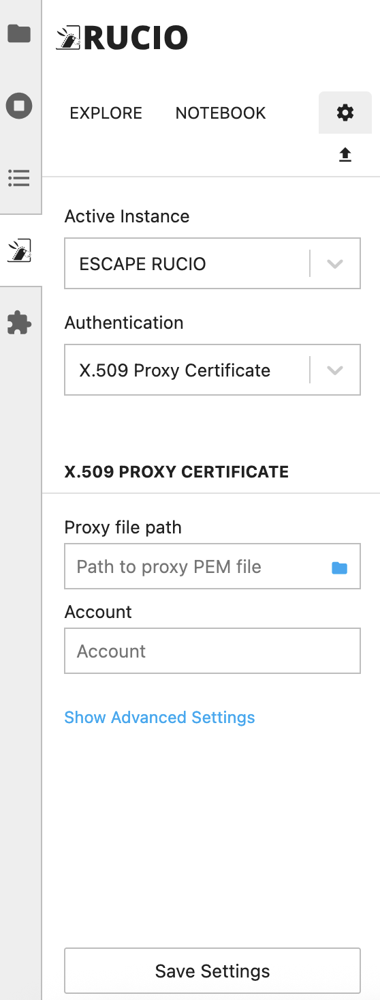

User Guide
===========

How to access the prototype platform
------------------------------------

.. IMPORTANT::
   To connect via ssh to the BETIF-DIFAET machine, you need to stay within the **INFN Bologna network** (either physically or through a VPN connection).

In order to access the Jupyterhub instance now, an user would need to connect via ssh to the BETIF-DIFAET machine and bind a port through the ``-D``  flag:

.. code-block:: bash

   $ ssh -ND 9999 <BETIF-DIFAET_machine>

and use the BETIF-DIFAET server as SOCKS proxy (the instructions on how to do this depend on the browser used):

* **Firefox**: *Settings* -> *Network settings* -> select *Manual proxy configuration* and type ``localhost`` on **Host SOCKS** with ``9999`` port;
* **Safari** and **Chrome** (on MacOS): Go to *SystemPreferences* -> *Network* -> *Wi-Fi* -> Click on *Details* next to the connected Wi-Fi -> *proxy* -> enable **SOCKS proxy** -> put the same information written above.

.. _jhub:

.. figure:: jhub.png
   :alt: Jhub
   
   `https://betif-difaet.jhub <https://betif-difaet.jhub>`_ landing page.

Once done, it is possible to access the dashboard connecting to `https://betif-difaet.jhub <https://betif-difaet.jhub>`_ entrypoint, as shown in :numref:`jhub`.

Clicking on *Sign in with OAuth2.0*, will redirect to the **IAM Einstein Telescope** login:

.. _iam:

.. figure:: iam.png
   :alt: IAM

   Einstein Telescope IAM login.

If the user is authorized to use the platform (possible only with a specific group name assigned by an admin), it will finally redirect to the JupyterLab image selection page:

.. _jlab-spawn:

.. figure:: jlab_spawn.png
   :alt: jlab_spawn

   JupyterLab image selection page.

JupyterLab image selection
--------------------------

The default base images visible on the ``Server Options`` page are:

+-----------------------------+-------------------------------------------------------+-------------------------------------------------------+
|         Image name          |                     Image path                        |                 Packages installed                    |
+=============================+=======================================================+=======================================================+
|    Almalinux9 base image    |    `ghcr.io/betif-difaet/jlab:betif-alma9-v0.0.6`_    |              Python 3.11, VOMS client                 |
+-----------------------------+-------------------------------------------------------+-------------------------------------------------------+
| Almalinux9 Rucio base image | `ghcr.io/betif-difaet/jlab:betif-alma9-rucio-v0.0.6`_ | Python 3.11, VOMS client, Rucio lab extension and CLI |
+-----------------------------+-------------------------------------------------------+-------------------------------------------------------+

.. _ghcr.io/betif-difaet/jlab:betif-alma9-v0.0.6: https://github.com/betif-difaet/custom_images/pkgs/container/jlab/482306514?tag=betif-alma9-v0.0.6
.. _ghcr.io/betif-difaet/jlab:betif-alma9-rucio-v0.0.6: https://github.com/betif-difaet/custom_images/pkgs/container/jlab/482306928?tag=betif-alma9-rucio-v0.0.6

Create your own JupyterLab image
^^^^^^^^^^^^^^^^^^^^^^^^^^^^^^^^

Here you will learn how to leverage your own image (libraries, code etc) to execute your JupyterLab notebooks.

**Example: add the Keras python library**

- First, you have to create a file named Dockerfile, with the series of instructions required to install all the required packages.

.. IMPORTANT::
   The only requirement is that the image **has to be derived from one of the base images listed above**, to avoid compatibility issues.

As an example:

.. code-block:: dockerfile

   FROM ghcr.io/betif-difaet/jlab:betif-alma9-rucio-v0.0.6
   RUN python3 -m pip install keras

- To make the image visible on the platform, there are several options available:

   1. **Build the image locally**: 
      - Build the image with the command:

      .. code-block:: bash
     
         $ docker build -t custom-jlab .

      - Push it to a container registry (e.g., Docker Hub, GitHub Container Registry) that is accessible by the JupyterHub instance.
   
   2. **Use Github CI/CD to publish the image directly on GitHub**

      - Create a public repository on GitHub;
      - Add the Dockerfile to the repository;
      - Create an additional file named ``publish.yaml`` in the ``.github/workflows`` directory with the following content:

      .. code-block:: yaml

         name: docker-publish
         
         on:
            push:
               branches: [ "main" ]
               tags:
               - "*"
         jobs:
            build-and-push-image:
               runs-on: ubuntu-latest
               steps:
               - name: Checkout
                 uses: actions/checkout@v2
               - name: Set up QEMU
                 uses: docker/setup-qemu-action@v1
               - name: Set up Docker Buildx
                 uses: docker/setup-buildx-action@v1
               - name: Login to GitHub Container Registry
                 uses: docker/login-action@v1
                 with:
                   registry: ghcr.io
                   username: ${{ github.repository_owner }}
                   password: ${{ secrets.GITHUB_TOKEN }}
               - name: Get Repo Owner
                 id: get_repo_owner
                 run: echo ::set-output name=repo_owner::$(echo ${{ github.repository_owner }} | tr '[:upper:]' '[:lower:]')
               - name: Build container image
                 uses: docker/build-push-action@v2
                 with:
                   outputs: "type=registry,push=true"
                   tags: |
                     ghcr.io/${{ steps.get_repo_owner.outputs.repo_owner }}/custom-jlab:latest
                   platforms: linux/amd64
        
      - After committing (and pushing) all these files to the repository, a workflow will be triggered (as shown with a yellow dot 
        near your last commit in GitHub). Clicking on that dot will show you the execution log (in case of debugging).
      - After a successful execution (green tick), your image will be visible on the right bar of the repository (under ``Packages``).
      - If you click on the image name, you will find a link to the image (starting with ``ghcr.io/...``), that you can copy/paste in the 
        platform ``Server Options`` page.

      .. WARNING::
         Make sure the repository has **read/write permissions** for actions. To can change that under Settings -> Actions -> Workflow permissions

Available platform components usage
-----------------------------------

The platform provides several components that can be used to develop and run your JupyterLab notebooks. Here a list of the current available 
components and their usage:

CVMFS
^^^^^

CVMFS is a distributed filesystem that provides access to software and data repositories.
The filesystem is mounted in the JupyterLab environment, available at the path ``/cvmfs``.

Among the available repositories, you can find:

- **grid.cern.ch**: the CERN Grid software repository, containing the CA certificates and the VOMS configurations;
- **sft.cern.ch**: the CERN Software repository, containing the `LCG software stack`_;
- **unpacked.cern.ch**: the CERN Unpacked repository, containing user defined container images.

.. _`LCG software stack`: https://lcginfo.cern.ch/

Rucio lab extension
^^^^^^^^^^^^^^^^^^^

Rucio enables centralized management of large volumes of data backed by many heterogeneous storage backends.
The Rucio lab extension provides a user-friendly interface to interact with Rucio, allowing users to manage datasets, files, 
and storage elements directly from JupyterLab.

To use the Rucio lab extension, you need to have a **valid Rucio account** and the necessary permissions to access the data.

.. IMPORTANT::

   For the authentication, you can use VOMS proxies. To create a proxy, you can use the following command:

   .. code-block:: bash

      $ voms-proxy-init --voms <VO_NAME> -old --key .globus/userkey.pem --cert .globus/usercert.pem
   
   Replace `<VO_NAME>` with the name of your Virtual Organization (e.g., ``escape``). The ``.globus/userkey.pem`` and 
   ``.globus/usercert.pem`` files are the private key and certificate files, respectively, that you can obtain from your GRID 
   credentials.

To use the Rucio lab extension, follow these steps:

1. **Open the Rucio lab extension**: Click on the Rucio icon in the JupyterLab sidebar;

2. **Authenticate**: Go to the **Settings** icon, as shown in :numref:`rucio-settings`. Under ``Proxy file path``, enter the path
to your VOMS proxy file (normally in ``/tmp/x509up_u0``). Under ``account`` enter your Rucio account name. Click on ``Save Settings``
to confirm.

.. _rucio-settings:

   
   Rucio lab extension settings.

3. **Browse datasets**: Use the Rucio lab extension to browse datasets, containers, and files. You can also include datasets in your 
   JupyterLab notebooks by clicking on the dataset and selecting the option to include it in your notebook.

.. NOTE::

   While not strictly necessary, Rucio is also available as a **command line interface (CLI)** tool. This is independent of the lab extension
   and can be used to interact with Rucio from the terminal. To use the CLI, you need to create a configuration file named ``rucio.cfg``, with
   the following content:

   .. code-block:: ini

      [client]
      rucio_host = https://vre-rucio.cern.ch
      auth_host = https://vre-rucio-auth.cern.ch
      ca_cert = /cvmfs/grid.cern.ch/etc/grid-security/certificates/
      account = <YOUR_RUCIO_ACCOUNT>
      auth_type = x509_proxy
      client_x509_proxy = /tmp/x509up_u0 

   Replace ``<YOUR_RUCIO_ACCOUNT>`` with your Rucio account name. The ``rucio_host`` and ``auth_host`` URLs are different for each Virtual Organization,
   so make sure to check the Rucio documentation for your specific VO (in the example above, the ``escape`` VO is used).
   Finally, create the environment variable ``$RUCIO_CONFIG`` pointing to the configuration file:

   .. code-block:: bash

      $ export RUCIO_CONFIG=/path/to/rucio.cfg

   Now, typing ``rucio whoami`` in the terminal will show your Rucio account information, confirming that the CLI is correctly configured.
