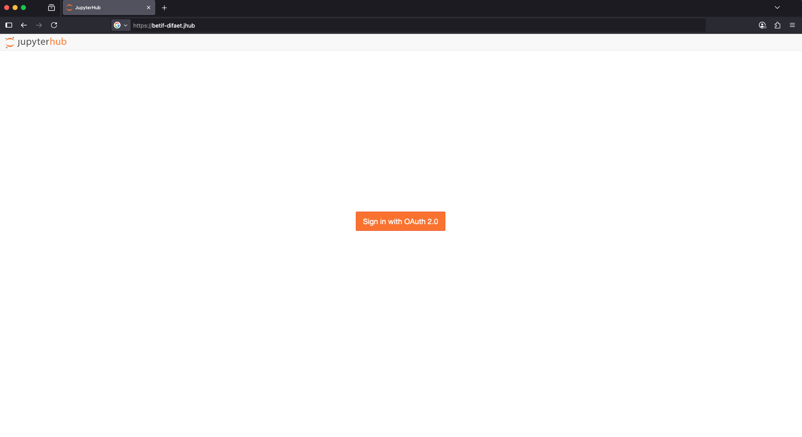
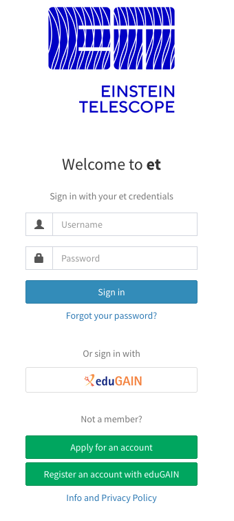
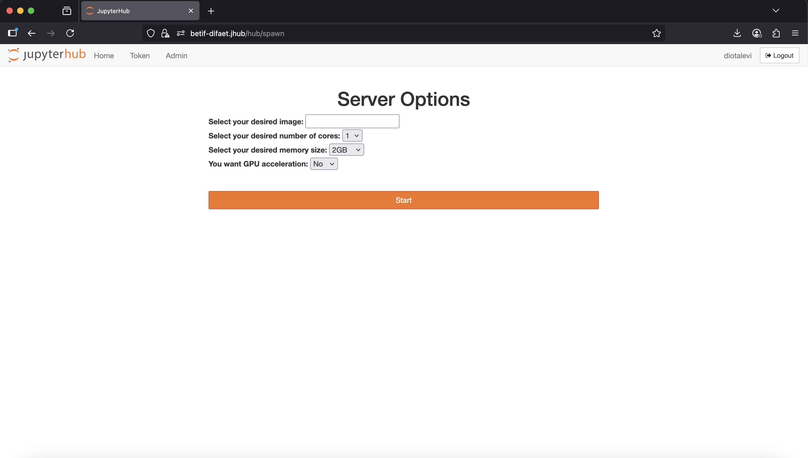

User Guide
===========

How to access the prototype platform
------------------------------------

In order to access the Jupyterhub instance now, an user would need to connect via ssh to the BETIF machine and bind a port through the ``-D``  flag:

.. code-block:: bash

   $ ssh -ND 9999 <BETIF_machine>

and use the BETIF server as SOCKS proxy (the instructions on how to do this depend on the browser used):

* **Firefox**: *Settings* -> *Network settings* -> select *Manual proxy configuration* and type ``localhost`` on **Host SOCKS** with ``9999`` port;
* **Safari** and **Chrome** (on MacOS): Go to *SystemPreferences* -> *Network* -> *Wi-Fi* -> Click on *Details* next to the connected Wi-Fi -> *proxy* -> enable **SOCKS proxy** -> put the same information written above.

.. _jhub:

   
   `betif.jhub <https://betif.jhub>`_ landing page.

Once done, it is possible to access the dashboard connecting to `betif.jhub <https://betif.jhub>`_ entrypoint, as shown in :numref:`jhub`.

Clicking on *Sign in with OAuth2.0*, will redirect to the **IAM Einstein Telescope** login:

.. _iam:

   Einstein Telescope IAM login.

If the user is authorized to use the platform (possible only with a specific group name assigned by an admin), it will finally redirect to the JupyterLab image selection page:

.. _jlab-spawn:

   JupyterLab image selection page.

The default image visible on the page is a base working image with only ``Python == 3.11`` installed.

