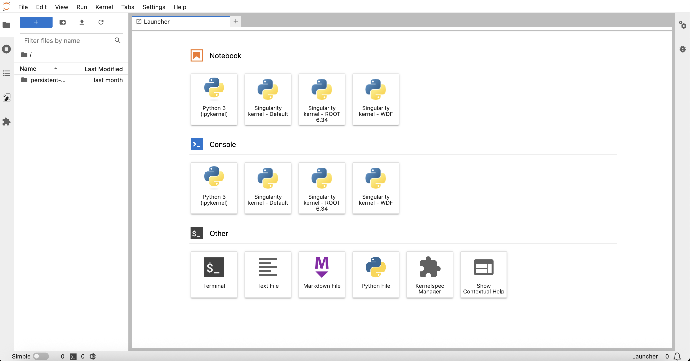

User Guide
===========

How to access the prototype platform
------------------------------------

.. IMPORTANT::
   To connect via ssh to the BETIF-DIFAET machine, you need to stay within the **INFN Bologna network** (either physically or through a VPN connection).
   
   **Contact the BETIF-DIFAET administrators to obtain the cluster machine IP address.**

In order to access the Jupyterhub instance now, an user would need to connect via ssh to the BETIF-DIFAET machine and bind a port through the ``-D``  flag:

.. code-block:: bash

   $ ssh -ND 9999 <BETIF-DIFAET_machine>

and use the BETIF-DIFAET server as SOCKS proxy (the instructions on how to do this depend on the browser used):

* **Firefox**: *Settings* -> *Network settings* -> select *Manual proxy configuration* and type ``localhost`` on **Host SOCKS** with ``9999`` port;
* **Safari** and **Chrome** (on MacOS): Go to *SystemPreferences* -> *Network* -> *Wi-Fi* -> Click on *Details* next to the connected Wi-Fi -> *proxy* -> enable **SOCKS proxy** -> put the same information written above.

.. _jhub:

.. figure:: jhub.png
   :alt: Jhub
   
   `https://betif-difaet.jhub <https://betif-difaet.jhub>`_ landing page.

Once done, it is possible to access the dashboard connecting to `https://betif-difaet.jhub <https://betif-difaet.jhub>`_ entrypoint, as shown in :numref:`jhub`.

Clicking on *Sign in with OAuth2.0*, will redirect to the **IAM Einstein Telescope** login:

.. _iam:

.. figure:: iam.png
   :alt: IAM

   Einstein Telescope IAM login.

If the user is authorized to use the platform (possible only with a specific group name assigned by an admin), it will finally redirect to the JupyterLab image selection page:

.. _jlab-spawn:

.. figure:: jlab_spawn.png
   :alt: jlab_spawn

   JupyterLab image selection page.

JupyterLab image selection
--------------------------

The default base images visible on the ``Server Options`` page are:

+--------------------------------------+---------------------------------------------------------------+-------------------------------------------------------+
|              Image name              |                          Image path                           |                   Packages installed                  |
+======================================+===============================================================+=======================================================+
|    Almalinux9 CPU-only base image    |      `ghcr.io/betif-difaet/jlab:betif-alma9-cpu-v0.2.1`_      |                Python 3.11, VOMS client               |
+--------------------------------------+---------------------------------------------------------------+-------------------------------------------------------+
|      Almalinux9 ROOT base image      | `ghcr.io/betif-difaet/jlab:betif-alma9-cpu-with-root-v0.2.1`_ |          Python 3.11, VOMS client, ROOT 6.34          |
+--------------------------------------+---------------------------------------------------------------+-------------------------------------------------------+
|  Almalinux9 CPU-with-GPU base image  |      `ghcr.io/betif-difaet/jlab:betif-alma9-gpu-v0.2.1`_      | Python 3.11, VOMS client, NVIDIA drivers, CUDA 12.4   |
+--------------------------------------+---------------------------------------------------------------+-------------------------------------------------------+

.. _ghcr.io/betif-difaet/jlab:betif-alma9-cpu-v0.2.1: https://github.com/betif-difaet/custom_images/pkgs/container/jlab/506490177?tag=betif-alma9-cpu-v0.2.1
.. _ghcr.io/betif-difaet/jlab:betif-alma9-gpu-v0.2.1: https://github.com/betif-difaet/custom_images/pkgs/container/jlab/506497746?tag=betif-alma9-gpu-v0.2.1
.. _ghcr.io/betif-difaet/jlab:betif-alma9-cpu-with-root-v0.2.1: https://github.com/betif-difaet/custom_images/pkgs/container/jlab/506490178?tag=betif-alma9-cpu-with-root-v0.2.1

.. WARNING::

   Make sure to select the image that best fits your needs. 
   
   For example, if you **do not need GPU capabilities**, it is better to select the CPU-only image.

   On the other hand, if **you need GPU capabilities**, make sure to select **Yes** in the JupyterHub spawn form, as shown in :numref:`jlab-spawn`, and select the CPU-with-GPU image. 
   Otherwise, the GPU resources will not be allocated to your notebook server and/or the NVIDIA drivers will not be available.

Choose your Jupyter kernel
--------------------------

After selecting the desired image and clicking on the **Start** button, the JupyterLab environment will start.

.. NOTE::

   The first startup may take a few minutes, as the server needs to be created and the image pulled from the container registry.

Once the JupyterLab environment is running, you can create a new notebook by clicking on the **Python 3** notebook kernels, as shown in :numref:`jlab-kernel`.

.. _jlab-kernel:

   JupyterLab kernel selection.

The available kernels shown in the home page are:

+---------------------------------+------------------+------------------------------------------------------------------------------------+
|           Kernel name           |  Python version  |                                Additional packages                                 |
+=================================+==================+====================================================================================+
|            `Python 3`           |     3.11.8       |                           None (local base environment)                            |
+---------------------------------+------------------+------------------------------------------------------------------------------------+
| `Singularity kernel - Default`_ |     3.11.14      |  Base image for custom Singularity containers - nothing pre-installed (see below)  |
+---------------------------------+------------------+------------------------------------------------------------------------------------+
|  `Singularity kernel - ROOT`_   |     3.11.14      | Base image for custom Singularity containers - ROOT 6.34 pre-installed (see below) |
+---------------------------------+------------------+------------------------------------------------------------------------------------+
|  `Singularity kernel - WDF`_    |     3.11.14      |                 Kernel singularity: WDF and PyTSA (from A. Ghinassi)               |
+---------------------------------+------------------+------------------------------------------------------------------------------------+

.. _`Singularity kernel - Default`: ghcr.io/betif-difaet/kernel-default:v1.2.0
.. _`Singularity kernel - ROOT`: ghcr.io/betif-difaet/kernel-root:v1.2.0
.. _`Singularity kernel - WDF`: ghcr.io/betif-difaet/kernel-wdf:v1.2.0

The `Python 3` local kernel is lightweight and does not include any additional packages (to avoid overloading the JupyterLab environment).

The `Singularity kernels` are designed to run **custom kernels** based on Singularity images. These images can be customized by the users to include
specific libraries and tools required for their work. More details on how to create your own Singularity image are provided in the next section.

They are **accessible via CVMFS** where they can be accessed by all the users of the platform.

Create your own custom singularity kernel image
^^^^^^^^^^^^^^^^^^^^^^^^^^^^^^^^^^^^^^^^^^^^^^^

Here you will learn how to leverage your own kernel image (containing libraries, tools etc) to execute your Jupyter notebooks.

**Example: add the Keras python library**

- First, you have to create a file named Dockerfile, with the series of instructions required to install all the required packages.

.. IMPORTANT::
   The only requirement is that the custom kernel image **must be based** on the following base kernel image:

   ``ghcr.io/betif-difaet/kernel-default:v1.2.0``: for a clean sheet kernel;

   ``ghcr.io/betif-difaet/kernel-root:v1.2.0``: for a kernel with ROOT 6.34 pre-installed.

As an example:

.. code-block:: dockerfile

   FROM ghcr.io/betif-difaet/kernel-default:v1.2.0
   RUN python3 -m pip install keras

- To make the image visible on the platform, there are several options available:

   1. **Build the image locally and upload it to a container registry** 
      - Build the image with the command:

      .. code-block:: bash
     
         $ docker build -t custom-kernel .

      - Push it to a container registry (e.g., Docker Hub, GitHub Container Registry) that is accessible by the JupyterHub instance.

      - Open a terminal on the Jupyterlab instance and download the image from the container registry:

      .. code-block:: bash

         $ singularity pull docker://<YOUR_CONTAINER_REGISTRY>/custom-kernel:latest

      - Move the downloaded `.sif` image somewhere in the persistent storage (otherwise it will be lost when the server is stopped);
      - Click on the `Kernelspec Manager` icon in the JupyterLab home page:

      .. figure:: kernelspec.png
         :alt: Kernelspec Manager

         JupyterLab Kernelspec Manager icon.

      - In the Kernelspec Manager page, click on the `Template` icon circled in red in :numref:`kernelspec-template` to create a new kernel template:

      .. _kernelspec-template:

      .. figure:: singularity_kernel.png
         :alt: Kernelspec Template

         Create a new Singularity kernel template.

      - Insert the local absolute path to the Singularity image in the window that appears, and click on `Create Kernelspec`. The new kernel will now be available in the JupyterLab kernel selection page.

   2. **Add the kernel in the BETIF-DIFAET custom kernel repository, to make it available to all users**

      - Clone the BETIF-DIFAET `custom kernels repository`_:

      .. _custom kernels repository: https://github.com/BETIF-DIFAET/custom_kernels

      .. code-block:: bash

         git clone https://github.com/BETIF-DIFAET/custom_kernels.git

      - Add a new folder named ``<your_kernel_name>`` in the repository root, containing the Dockerfile created before;
      - Create a ``README.md`` file in the same folder, describing the kernel purpose and the packages installed;
      - Do a pull request to the repository. After the merge, the new kernel image will be automatically built and published to the GitHub Container Registry;
      - After a few hours, the new kernel image will be available to all users in the following path:

      .. code-block:: bash

         /cvmfs/unpacked.cern.ch/ghcr.io/betif-difaet/kernel-<your_kernel_name>:latest

      - Load the kernel in your JupyterLab environment, following the same steps described in the previous option (Kernelspec Manager -> Create new template etc).
      Make sure to use the **full absolute CVMFS path** to the Singularity image.

.. NOTE::

   We are planning to move the custom kernels to the `unpacked` service of INFN: ``/cvmfs/unpacked.infn.it`` (already mounted in the JupyterLab environment).
   
   This service, however, is still a work in progress from INFN Cloud: when it will be ready, we will migrate all the custom kernels there and we will notify all users.

Available platform components usage
-----------------------------------

The platform provides several components that can be used to develop and run your JupyterLab notebooks. Here a list of the current available 
components and their usage:

CVMFS
^^^^^

CVMFS is a distributed filesystem that provides access to software and data repositories.
The filesystem is mounted in the JupyterLab environment, available at the path ``/cvmfs``.

Among the available repositories, you can find:

- **grid.cern.ch**: the CERN Grid software repository, containing the CA certificates and the VOMS configurations;
- **sft.cern.ch**: the CERN Software repository, containing the `LCG software stack`_;
- **unpacked.cern.ch**: the CERN Unpacked repository, containing user defined container images.

.. _`LCG software stack`: https://lcginfo.cern.ch/

Rucio lab extension
^^^^^^^^^^^^^^^^^^^

Rucio enables centralized management of large volumes of data backed by many heterogeneous storage backends.
The Rucio lab extension provides a user-friendly interface to interact with Rucio, allowing users to manage datasets, files, 
and storage elements directly from JupyterLab.

To use the Rucio lab extension, you need to have a **valid Rucio account** and the necessary permissions to access the data.

.. IMPORTANT::

   For the authentication, you can use VOMS proxies. To create a proxy, you can use the following command:

   .. code-block:: bash

      $ voms-proxy-init --voms <VO_NAME> -old --key .globus/userkey.pem --cert .globus/usercert.pem
   
   Replace `<VO_NAME>` with the name of your Virtual Organization (e.g., ``escape``). The ``.globus/userkey.pem`` and 
   ``.globus/usercert.pem`` files are the private key and certificate files, respectively, that you can obtain from your GRID 
   credentials.

To use the Rucio lab extension, follow these steps:

1. **Open the Rucio lab extension**: Click on the Rucio icon in the JupyterLab sidebar;

2. **Authenticate**: Go to the **Settings** icon, as shown in :numref:`rucio-settings`. Under ``Proxy file path``, enter the path
to your VOMS proxy file (normally in ``/tmp/x509up_u0``). Under ``account`` enter your Rucio account name. Click on ``Save Settings``
to confirm.

.. _rucio-settings:

.. figure:: rucio.png
   :alt: Rucio settings
   :width: 30%
   
   Rucio lab extension settings.

3. **Browse datasets**: Use the Rucio lab extension to browse datasets, containers, and files. You can also include datasets in your 
   JupyterLab notebooks by clicking on the dataset and selecting the option to include it in your notebook.

.. NOTE::

   While not strictly necessary, Rucio is also available as a **command line interface (CLI)** tool. This is independent of the lab extension
   and can be used to interact with Rucio from the terminal. To use the CLI, you need to create a configuration file named ``rucio.cfg``, with
   the following content:

   .. code-block:: ini

      [client]
      rucio_host = https://vre-rucio.cern.ch
      auth_host = https://vre-rucio-auth.cern.ch
      ca_cert = /cvmfs/grid.cern.ch/etc/grid-security/certificates/
      account = <YOUR_RUCIO_ACCOUNT>
      auth_type = x509_proxy
      client_x509_proxy = /tmp/x509up_u0 

   Replace ``<YOUR_RUCIO_ACCOUNT>`` with your Rucio account name. The ``rucio_host`` and ``auth_host`` URLs are different for each Virtual Organization,
   so make sure to check the Rucio documentation for your specific VO (in the example above, the ``escape`` VO is used).
   Finally, create the environment variable ``$RUCIO_CONFIG`` pointing to the configuration file:

   .. code-block:: bash

      $ export RUCIO_CONFIG=/path/to/rucio.cfg

   Now, typing ``rucio whoami`` in the terminal will show your Rucio account information, confirming that the CLI is correctly configured.
